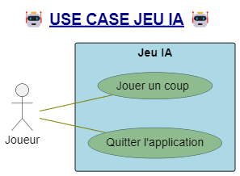
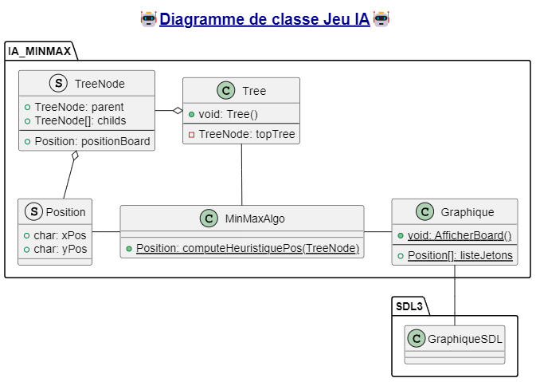

# JEU IA: PROJET DE JEU DE TABLE POUR DÉMONTRER UN IA SIMPLE

## Description

### Jeu IA
Ce jeu de table a pour objectif d'obtenir 4 marqueurs de suite tout en empêchant l'adversaire d'y parvenir.

### Contexte
Dans le cadre de ma recherche d'emplois de 2025, suite à ma diplômation.

## Visuels

---

## Usage

### Compiler le code

"cmake --build ."  Dans le répertoire build, l'exécutable se trouvera dans le répertoire build/

### Run program

Ouvrir le fichier code .exe sur Window ou .jeu sur Linux

## Membres

- Maxim thibodeau

## Status du projet
Code (0%)
