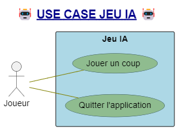
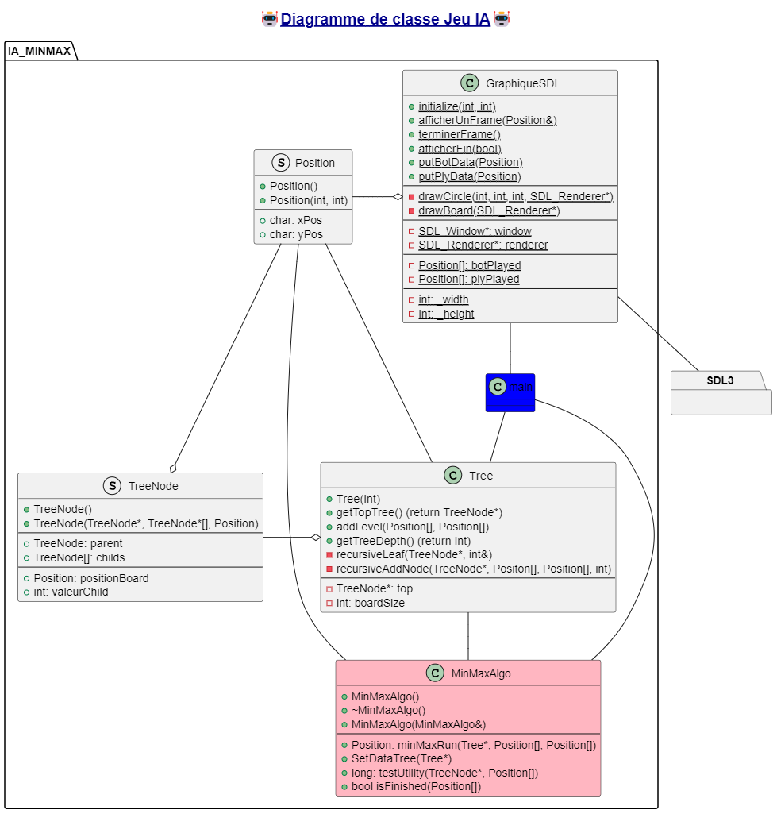

# JEU IA: PROJET DE JEU DE TABLE POUR DÉMONTRER UN IA SIMPLE

## Description

### Jeu IA
Ce jeu de table a pour objectif d'obtenir plusieurs marqueurs de suite tout en empêchant l'adversaire d'y parvenir.

### Contexte
Dans le cadre de ma recherche d'emplois de 2025, suite à ma diplômation.

### Bugs

#### Quand le joueur va ganer s'il joue de façon optimal, le résultat est bizzard
#### Quand l'IA peut gagner avec certitude dans plusieurs tours, il préfère plusieurs à 1, pour accumuler des points d'utilités
#### Ma première tentative de multithreads a échoué

## Visuels

---

## Usage

### Prérequis

- Git
- Compilateur (Visual studio ou gcc)
- CMake

### Compiler le code

"cmake .." Dans le répertoire build qu'il faut créer

"cmake --build ."  Dans le répertoire build, l'exécutable se trouvera dans le répertoire build/

### Run program

Ouvrir le fichier code .exe sur Window ou .o sur Linux

## Membres

- Maxim thibodeau

## Status du projet

Code (100%)
